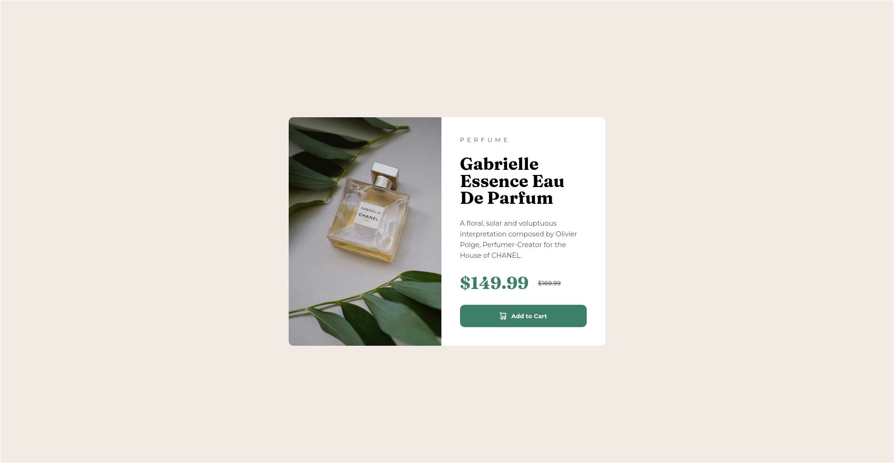

# Frontend Mentor - Product preview card component solution

This is a solution to the [Product preview card component challenge on Frontend Mentor](https://www.frontendmentor.io/challenges/product-preview-card-component-GO7UmttRfa). Frontend Mentor challenges help you improve your coding skills by building realistic projects. 

## Table of contents

- [Overview](#overview)
  - [Screenshot](#screenshot)
  - [Links](#links)
- [My process](#my-process)
  - [Built with](#built-with)
  - [What I learned](#what-i-learned)
  - [Continued development](#continued-development)
  - [Useful resources](#useful-resources)
- [Author](#author)


## Overview

### Screenshot



### Links

- Solution URL: [Solution](https://www.frontendmentor.io/solutions/product-preview-card-component-solution-using-mobile-first-workflow-ES2taARNL7)
- Live Site URL: [Live Site](https://product-card-demo-tm.netlify.app/)

## My process

### Built with

- Semantic HTML5 markup
- CSS custom properties
- Flexbox
- CSS Grid
- Mobile-first workflow

### What I learned

- I learned how to use `<picture></picture>` tags to switch images without using javascript.
    ```html
    <picture>
          <!-- Desktop image -->
          <source srcset="images/image-product-desktop.jpg" media="(min-width: 768px)" class="desktop-img">
  
          <!-- Mobile image (fallback and default) -->
          
    </picture>
    ```

- I learned how to use `:hover` and `:focus` psuedo-classes.
    ```css
    .purchase-button:hover{
        /* code here */
    }

    .purchase-button:hover .button-text {
        /* code here */
    }

    .purchase-button:focus{
       /* code here */
    }

    ```
- I learned how to use `@media` queries to handle responsiveness of pages on both mobile and larger screens.

    ```css
    @media (min-width: 768px) {
        /* code here */
        /* it will activate when width of screen is >= 768px*/
    }

    ```


- I learned that I should focus on building mobile version of a page and then proceed to scale it to larger screens. Because doing otherwise is messy.


### Continued development

I am looking forword to continue learning Responsive design and handling of pages for both desktop and mobile at the same time. I learnt a lot from this project and I am looking forword to learn more. I am looking forword to learn the box-shadow css property as it feels complex.

### Useful resources

- [Box Shadow Generator](https://cssgenerator.org/box-shadow-css-generator.html) - This helped me for creating and refining box-shadows easily. I really liked this tool and will use it going forward.
- [Live Server](https://ritwickdey.github.io/vscode-live-server/docs/settings.html) - This is a great tool that instantly upgrades the web-pages without needing to refresh them manually. It helped me in this challenge.

## Author

- Website - [Tuhin Mandal](https://github.com/MandalTuhin)
- Frontend Mentor - [@MandalTuhin](https://www.frontendmentor.io/profile/MandalTuhin)
